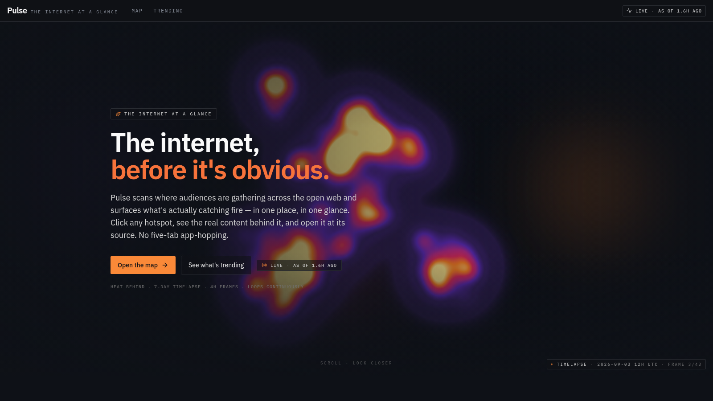
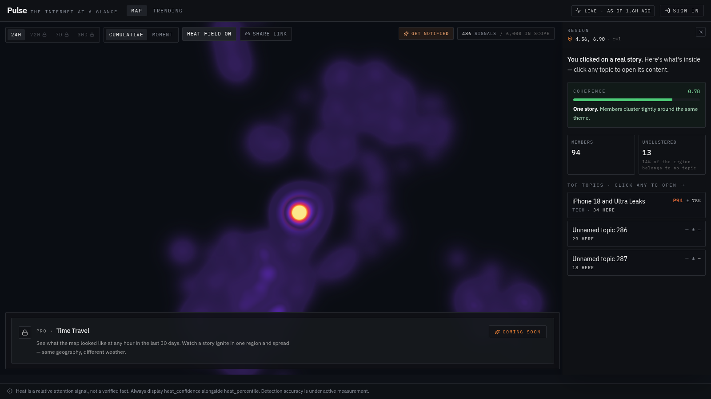

# Pulse

**The internet, before it's obvious.**

Pulse scans where audiences are gathering across the open web and surfaces what's actually catching fire — in one place, in one glance.

<p>
  
  
  
</p>

---



Every warm region on the field is a topic gaining attention on the open web right now. The hero loops a rolling 7-day timelapse so the shape of the week is legible at a glance.



Click any hotspot on the map and Pulse opens a region panel: how coherent the members are, how many pieces of content sit inside, and which topics they belong to. From there it's one click to the content itself, at its original source.

## What Pulse does

- **Scan.** Watch attention accrue across the open web in a single 2-D field, not five browser tabs.
- **Discover.** Click any hotspot to see what's actually inside — the topics, the members, and a plain-English read on how tightly they cluster.
- **Jump in.** Open any piece of content at its original source. No app-hopping.

Every score ships with its confidence. Heat is a relative attention signal, not a verified fact — and Pulse is honest about that everywhere it appears.

## Current state

Pulse is growing. We are actively training and refining data models on the live heat signal so the platform reads the internet more accurately, more broadly, and much faster over time. Expect the coverage, the scoring, and the topic clustering to keep sharpening on a weekly cadence.

The public site today ships the **Map**, the **Trending** feed, and the **Topic detail** view. A signed-in Pro tier — time travel, extended windows, cluster summaries, and richer per-topic depth — is next on the roadmap.

## Architecture

This repository contains **the Pulse web frontend only**. The backend — data ingestion, model training, ranking, and the API that serves this frontend — lives in a separate private repository and is not distributed here. Nothing in this tree ships hostnames, endpoint paths, provider identifiers, or credentials for that backend; the frontend reads them from environment variables at runtime.

## Tech stack

- React (Create React App) + React Router
- Tailwind CSS + shadcn/ui
- deck.gl (`@deck.gl/react`, `@deck.gl/aggregation-layers`) for the 2-D WebGL heat map and timelapse hero
- TanStack Query for data fetching, caching, and 402-aware locked-feature handling
- Recharts for velocity arcs, radar closeness, and sparklines

## Running locally

This app needs a live Pulse API and a small set of environment variables that are **not distributed with the repository**. If you have been granted access, request the current `.env` values from the maintainers.

```bash
yarn install
yarn start
```

A minimal `.env` looks like this — actual values are provided out-of-band:

```env
REACT_APP_PULSE_API_BASE=your_api_base_here
REACT_APP_PULSE_KEY_FREE=your_key_here
```

Without these values the app will render, but every data surface will render its empty / no-key state.

## Security posture

This repository was audited before it was made public. Specifically:

- No `.env`, `.env.local`, or `.env.production` file is committed. `.gitignore` covers every environment file except an explicit `.env.example` template.
- No API base URLs, backend hostnames, auth-provider dashboard URLs, or tenant identifiers appear anywhere in source.
- No auth publishable keys, service account IDs, or key fingerprints are checked in — even ones technically safe to expose are treated as internal.
- Internal working documents (product notes, test reports, session memory) are not part of this tree.
- Screenshots show only the aggregate heat field and the region-panel summary view. The raw dot-level map is intentionally not depicted.

If you believe a secret has been checked in, please contact the maintainers before opening a public issue.

## Contributing

Pulse is a showcase repository. Issues are welcome; pull requests are by invitation. Please do not open PRs that add real API keys, tokens, or backend URLs — they will be rejected and the credentials treated as compromised.

## License

All rights reserved. The source is public so the product can be evaluated and understood; it is not licensed for reuse, redistribution, or derivative works without written permission.

## Credits

Built by **Calescent Labs**.
